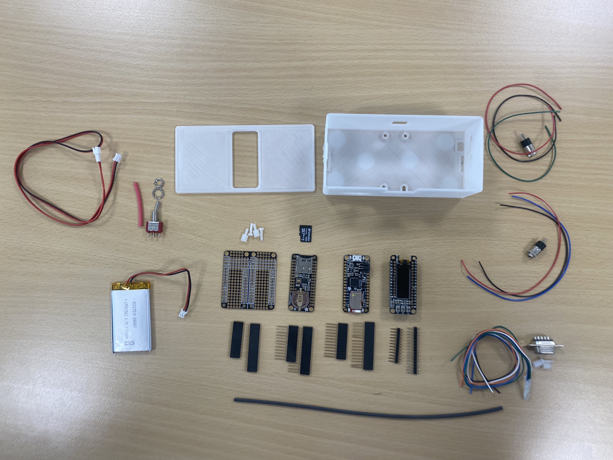

#  BOM 

* 1 Adafruit Feather M0 Bluefruit LE
 https://www.adafruit.com/product/2995 
  with stacking headers for Feather
https://www.adafruit.com/product/2830  
 
 
 * 1 FeatherWing Doubler - Prototyping Add-on
 https://www.adafruit.com/product/2890
with short stacking headers 
 https://www.adafruit.com/product/2886  
 
* 1 Adalogger FeatherWing - RTC + SD
https://www.adafruit.com/product/2922 
 with  stacking headers for Feather
https://www.adafruit.com/product/2830 
 
* 1 assembled Adafruit FeatherWing OLED 
 https://www.adafruit.com/product/3045 
  
* 1 mini SD Card (4 Go is enough)

* 1 Lithium Ion Polymer Battery - 3.7v 1000 or 1200mAh (a more powerful battery may not fit in the box)
   https://www.adafruit.com/product/258
 
 (Be very careful if you buy an other LiPo battery. The power and GND may be inverted (compared to what you can see on the picture). You can still swap them, using a sharp pin to extract the cables from the connector).
 

* 1 SPDT Switch
  https://www.adafruit.com/product/3221 
  
* 1 JST-PH Battery Extension Cable - 500mm 
 https://www.adafruit.com/product/1131
 
* 2x 3.5 female Jack connectors
 
* 1 Sub-D DB9 female connector
 
* 4 x M2.5 Machine Screws and Nuts

* 2 x M3x8 Screw ans Nuts

* connection cables

* heat-shrinkable tubes

* 3D printed box (cf [stl](../Hardware/BaahBox/))
 

