# Bahh Box User Guide

####Version 0.1 28/05/2019

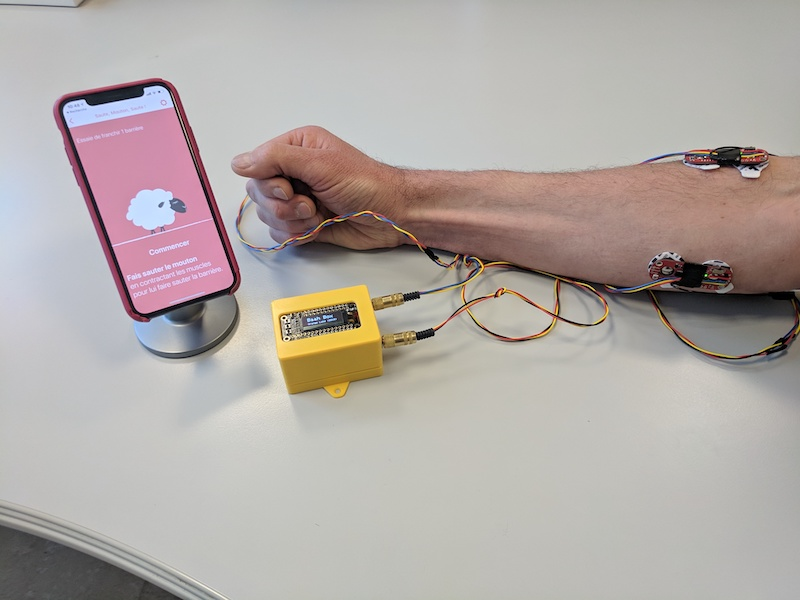

&nbsp;

## Initialisation
- Connect the sensors to the box (via the jack sockets, as in the photo above)

- Switch on with the small switch on the side of the box (switch to the red tape).

##### Warning: The start-up may take several seconds.

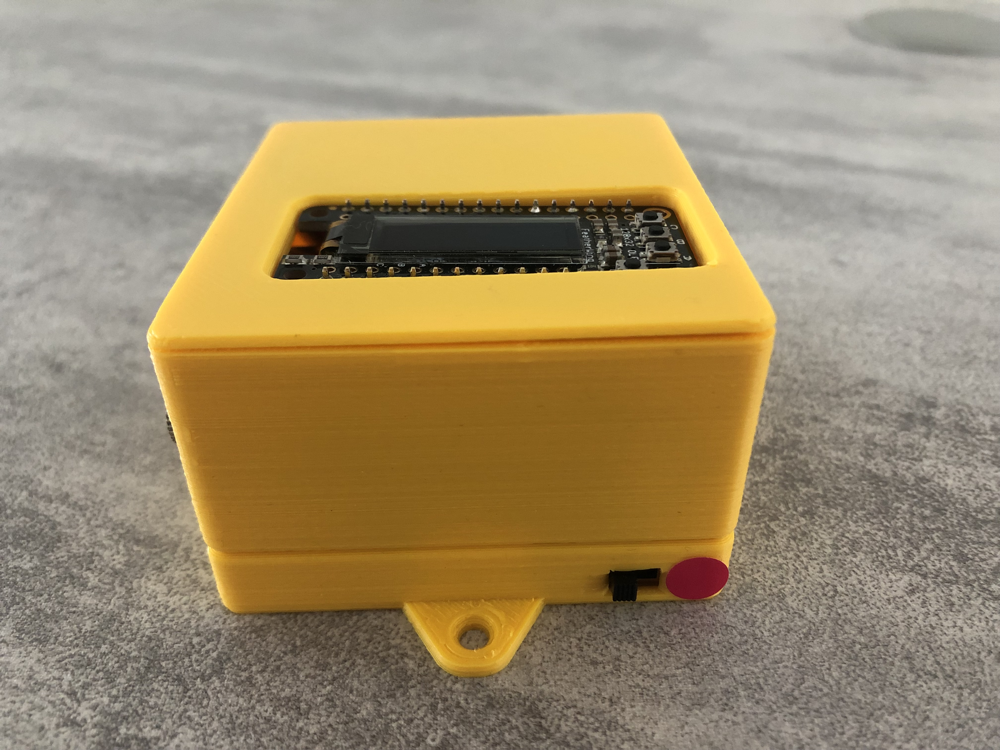

 

- Wait 2-3 s until the screen displays small white dots.

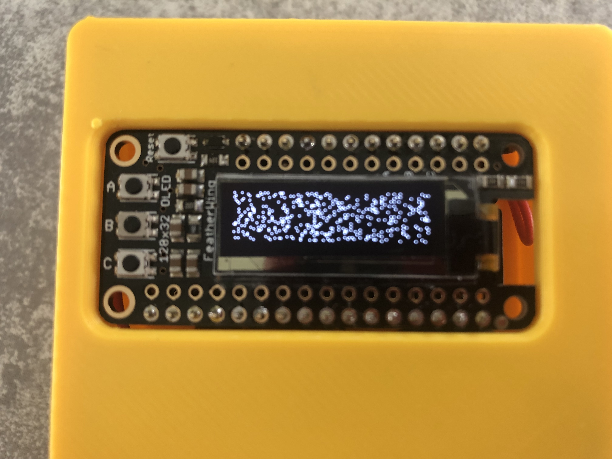

- Press the ** Reset ** button at the top left of the screen, and after 2s the screen displays "Baah Box":

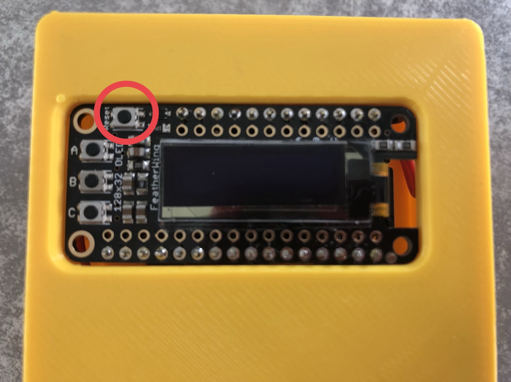

 

## Check the behavior of the sensors

- Put the sensors on the muscles to be trained.

- Press the ** - B - ** button to display the curves of the data sent by the sensors.

- A press displays the 2 sensors,

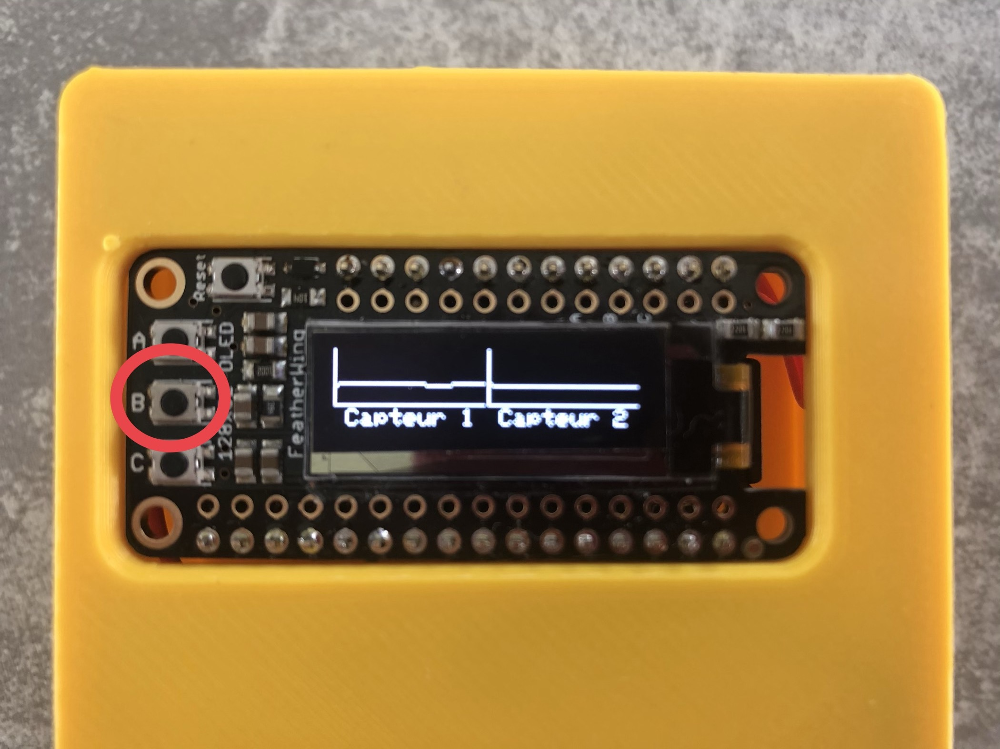

- Second press display sensor 1 only,

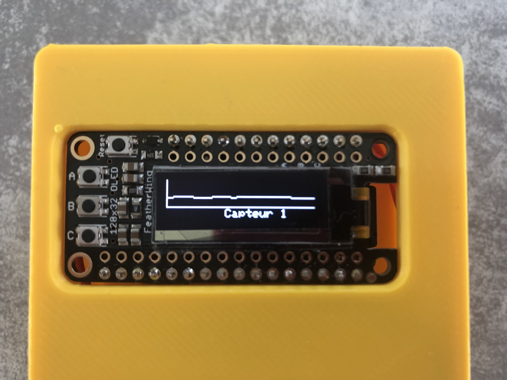

- 3rd press display sensor 2 only,

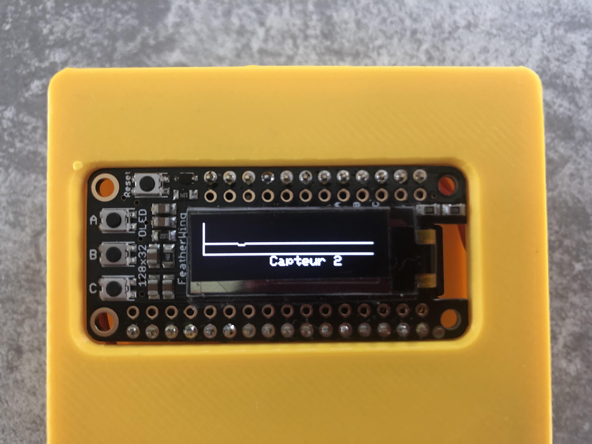

- 4th press display joystick status,

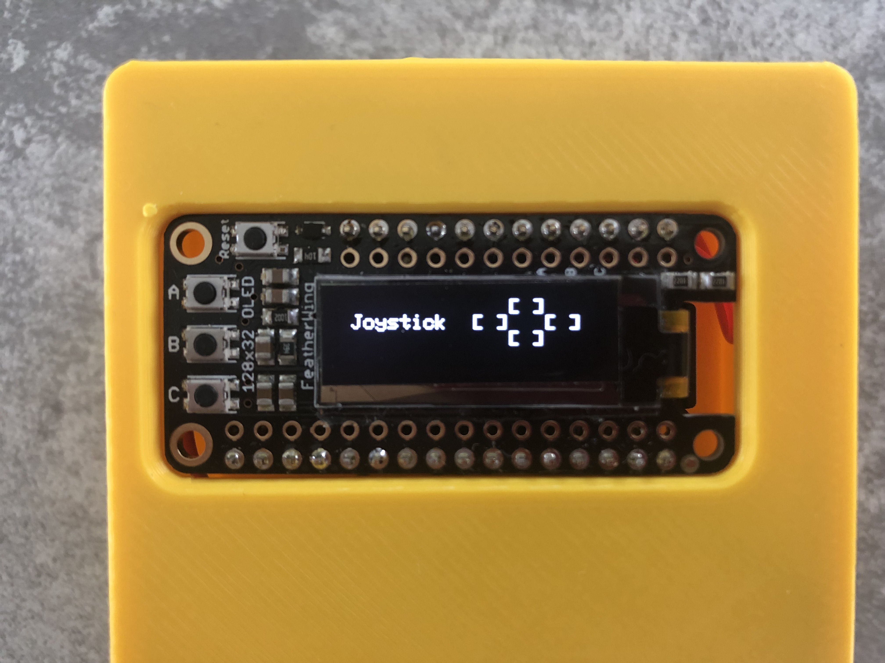

- One more press go back to display with 2 sensors.

## General information about the box

- Press **-C** button to display box global settings.

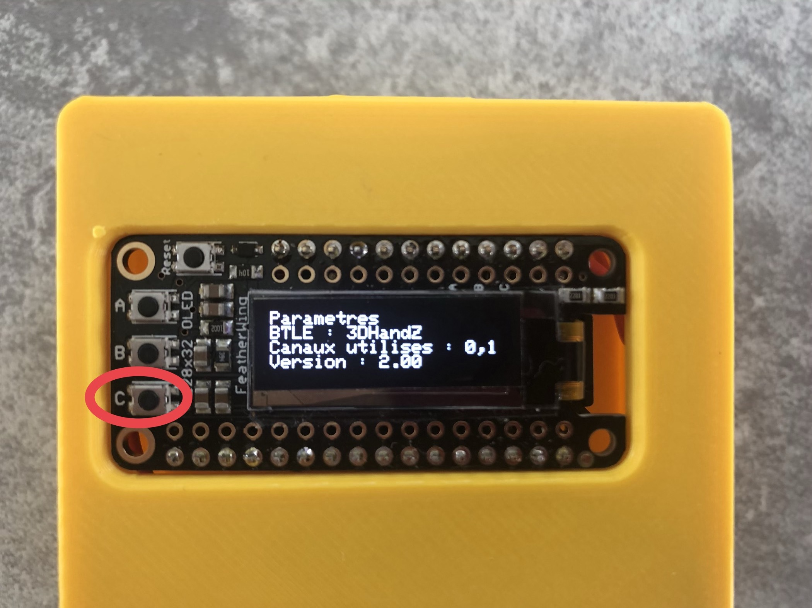

- A second press display battery level

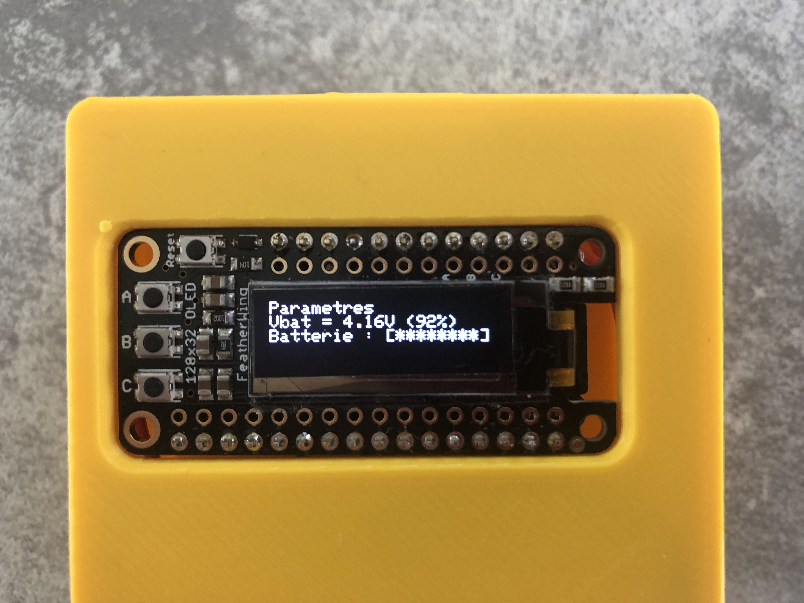

&nbsp;

## Connection to mobile application

- Check that bluetooth is activated on the mobile/tablet

- Run **Baah!** game on the mobile/tablet

- A message is displayed to ask to choose the Baah Box you want to connect to

- tap on **"Connexion"**

Connection screen is displayed

- choose the box in the list __-and-__ tap on OK upper right

###Go back to the main menu by using the upper left arrow.

## Choose a game in the list

For each game, an animation show you how to play.  Press **"Start"** to play.

###Important information for games

####Don't forget to close the application on the mobile/tablet after each use.

&nbsp;

## Settings

To access the different settings, press the small notched wheel located at the top right of the screen of the mobile / tablet.

##### Several categories of settings are available:

- Connection: to select another BaahBox
- General:
	- Activate demo mode
	- Select sensors to use
	- Adjust the sensitivity of the games and the detection threshold of the sensors
- Game management: to adjust the parameters specific to each game

### Connection setting
This part manages the connection and disconnection of your BaahBox.

Select the BaahBox from the list. Then press OK at the top right of the screen.
When the connection is successful, the application go back to the previous screen.

If your mobile is already connected to a BaahBox, it will appear with a check mark on its left. Press the "Logout" button to logout from this BaahBox.

### General setting
This part allows you to configure global settings for the whole application. Once done, tap "Settings" in the top left to return to the previous screen.

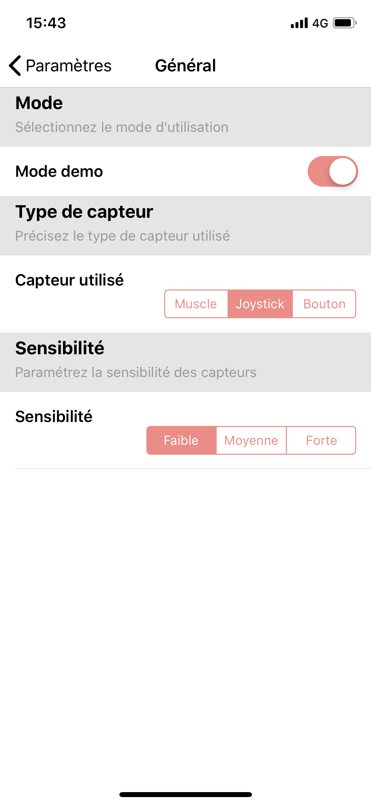

 

### Game settings

This part allows a specific setting for each game.
Once the settings have been selected, they are immediately taken into account by the game.

&nbsp;

# Appendix

## Using the buttons on the housing

There are 3 buttons on the left of the screen (**A**, **B**, **C**)

and a button above the screen: **Reset**

### The **Reset** button allows you to restart the box
### The **A** button displays the home page (the Baah Box banner)

### The **B** button is used to check the correct functioning of the sensors
(see the corresponding section at the beginning of the document)

### The ** C ** Button displaying configuration information and the battery level

- 1st press: display the following information:

	- BTLE: name of the Baah Box (defined on the SD card)
	- Channels used: association of sensor pins with sensors 1 or 2 (defined on the SD card)
	- Version: version of the "Baah Box" software

- 2nd press: display information on the battery
	- battery voltage
 	- battery charge level (in %)
 	- fast display graph for the state of charge

# To recharge the battery of the box

## Important

### To recharge the battery, connect the box to the USB charger,
### ** but leave the box on ** (switch to red tap)
