# Build your sensors to use with your Baah Box

## Electromyography (EMG) Sensors

This kind of sensors measure muscle activity by detecting its electric potential.

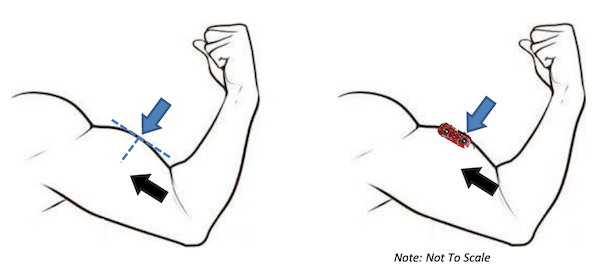

You will find below two example of such sensors :
	- https://www.sparkfun.com/products/13723 
	- https://www.seeedstudio.com/Grove-EMG-Detector-p-1737.html

You will have to be careful when positioning the electrodes on the muscle:  two of them have to be placed on the muscle (parallel to  the muscle fibers) for which you want to measure the activity.
The third electrode serves as a reference, and has to be placed outside the muscle area.

You will find plenty of links and instructions on the web on how to use those sensors.

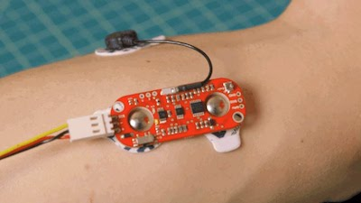

### Connection

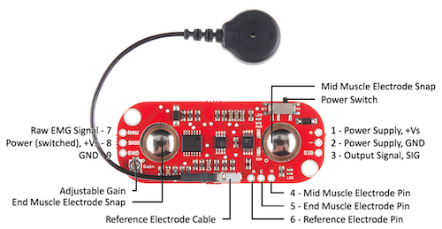

 You will have to use the 3 pins "+", "-", "sig" (as shown below on to the right of the sensor).

###  Soldering

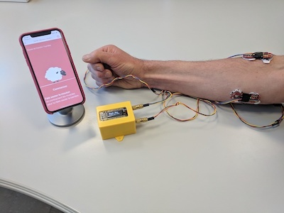
 
You will have to connect the sensor to a 3.5mm stereo male jack, 
using 3 (approx. 1 m long) cables - one for Vcc, one for the Ground, and one for the Signal.

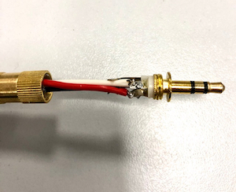

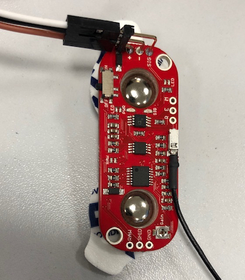

## Sliders

You can also use one or two sliders to play with the Baah Box. 
always using the same connection  as the myoware sensor.
**(Actually, any analog arduino sensor will do the trick)**

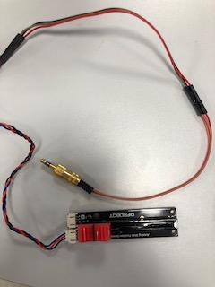

## Joystick

You can use an Arcade Joystick with its connection cable, like this one.

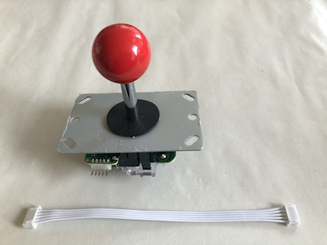

And cut one end of the cable to solder it to a male DB9 connector.

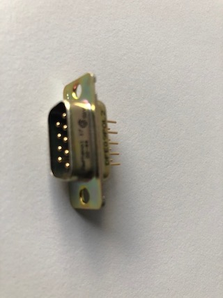
 
### Soldering 

The table below shows the connection to the DB9 male connector to the joystick pins.
 
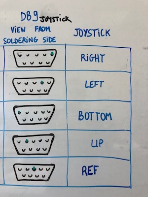

You will then be able to connect the Baah Box and the joystck with a DB9 male-female cable - and reuse the joystick for another use!

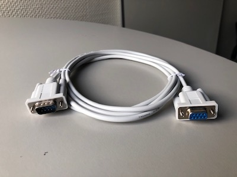

### In the box !

The final step is to put the joystick (and the DB9 connector soldered to it)
 in a home-made box, like so : 

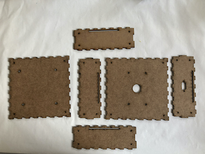

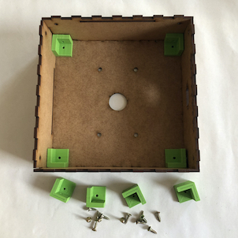

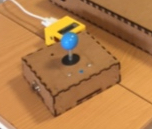

