# Building a Baah Box

# Equipment
The Baah Box consists of a BTLE compatible arduino card, an SD reader shield - with a 4GB SD card, a TFT screen, and connectors (2 jacks and / or a DB9 connector), all in a 3D printed case.

The jacks are used to connect sensors to a single analog output such as myoelectric sensors or potentiometers (sliders). The jacks can be used independently alone or together.

The DB9 is used to connect a sensor to several (digital) outputs. You can connect a joystick, for example.

The current code allows you to use either the jacks or the DB9, but not both at the same time. Since they do not use the same entries on the card, the code can be updated to allow simultaneous use.

### The list of items in the Baah Box is [here](../BaahBoxBoM.md).

## Choice of hardware

* We have chosen to take hardware that is easy to find (in an electronics store or on the internet). We wanted any "maker" with a 3D printer and able to make simple welds to make a Baah Box. *

The *"form factor"* of the cards we have chosen (Feather from Adafruit) makes it possible to stack them, and therefore to avoid the use/build of a specific printed circuit. This means that the construction of the box requires very few solders.

It is quite possible to use other cards, you will just have to modify the box and adapt the code.

## Printing the box
(download and print the [STL files](../3D/STLBaahBoxDB9.zip)).
The design of our box is an adaptation of that [proposed by Adafruit](https://learn.adafruit.com/3d-printed-case-for-adafruit-feather) for its Feather cards.
Adafruit offers [settings](https://learn.adafruit.com/3d-printed-case-for-adafruit-feather/3d-printing) for Cura and Simplify3D, which we recommend using.

## Arduino code

Please check the documentation [here](../../project/README.md) !

## Electronic

### Power
So that the box can be used anywhere, we added a battery, and a switch.
It is not mandatory to operate the card, which can just be connected to a usb power supply (5V).

We use the assembly proposed by Adafruit for [power](https://learn.adafruit.com/on-slash-off-switches)
You will find there all the information for the assembly to realize the cable below.

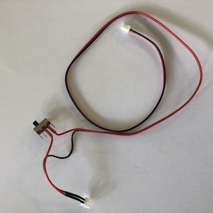

### Connectivity
We plug two types of connectors on the card:
stereo jacks and a DB9 connector.

To power the connectors, you can start by soldering
* the red wire on the 3.3V pin
* the black wire on the Feather.

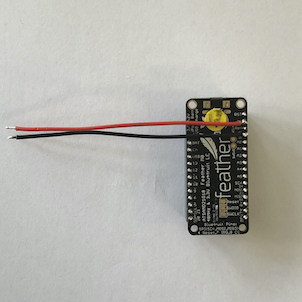

#### Jacks
The jacks are used to connect analog sensors to an output.
You need to solder 3 wires: Vcc, GND and signal.

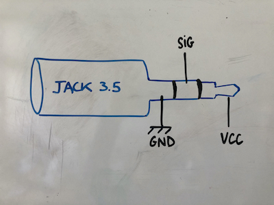

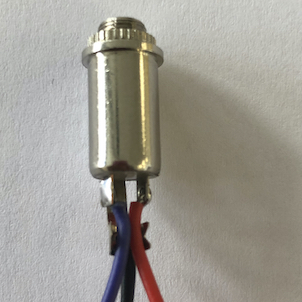

We solder the "signal" cables (blue and green) of the jack on the analog pins A0 and A1 of the Feather.

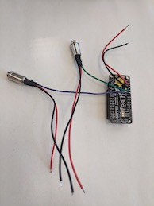

We solder the red wires (Vcc) of the jacks and the feather together.
We see in the pict that we use a heat-shrinkable sheath after soldering to avoid short circuits.

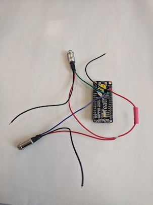

#### DB9
The DB9 is used to connect a sensor to several (digital) outputs. We connect a joystick to this DB9 connector, which does not need to be powered.
By cons we need to connect 5 cables:
* A wire (black) which will serve as a reference (soldered to ground (GND),
* 4 wires for the contactors of the different positions of the Joystick.

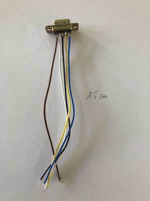

We solder together the black wires (GND) of the jacks and dB9 with the Feather one
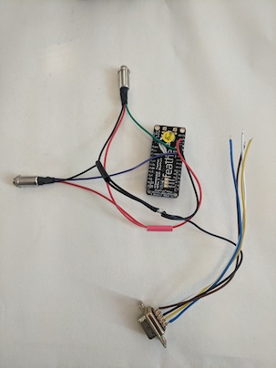

Then we solder the connector wires on the Feather, according to the table below:

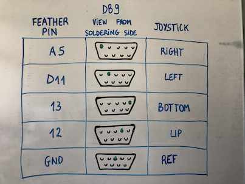

We see on this diagram the correspondence with the positions of the joystick which will be connected to it.
For example: when the Joystick is in the high position, the signal from pin 12 of the Feather will go from 0 to 1.

## Assembling:

Once everything is soldered, you have to put everything in the box!

We use the user manual provided by Adafruit to assemble the feather box with a battery, adding our modifications (adding connectors).
We advise you to follow the steps as indicated in this [user manual](https://learn.adafruit.com/3d-printed-case-for-adafruit-feather/assembly), adding the screwing of the connectors on the box.

- We start by positioning the battery and the switch

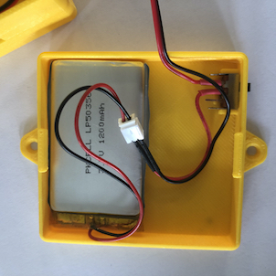

- we pass the battery connector through the hole in the bottom of the case
- We put the feather in place in the case.
As the cards pile up, you have the choice to screw only the feather in the case then stack the shields of the SD card and the screen.

With the screws between 19 and 25mm long, you can screw the feather and the SD card.
The screen shield is just clipped on.

- We screw the jacks in the two circular holes on the front side

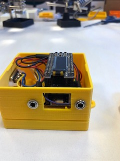

 and the DB9 in its insert on the side of the box.

 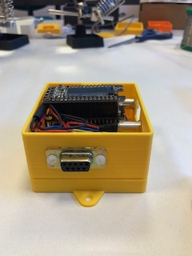

Everything is in the box, you have to close ...

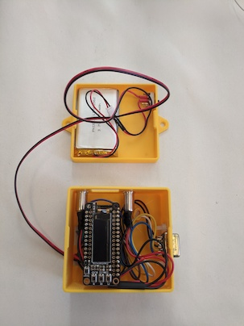

And here is the box mounted!

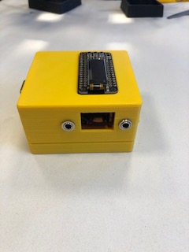
