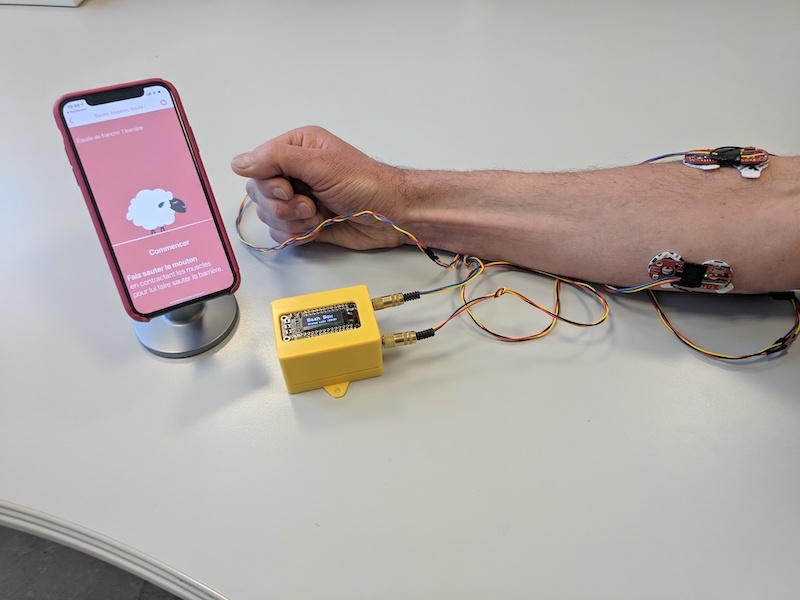
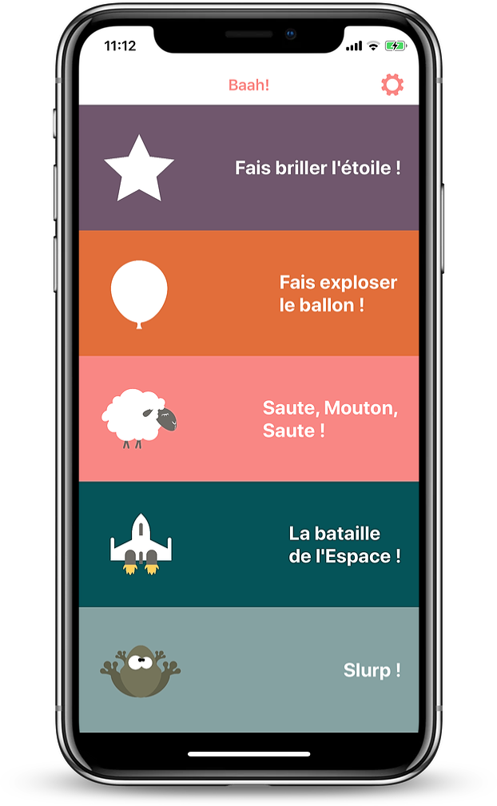

 

# What is the Baah Box ?

The _Baah Box_ project aims at providing individuals (children or adults) in need of motor recovering or rehabilitation with a new, innovative, portable and fun-to-use muscle training device.

The device could also be useful to people born with limb agenesis (or who suffered limb loss) and who will be equiped with a prosthesis in the near future. These people need to train specific muscles to learn how to control their future prosthesis.

## Rationale

Muscle rehabilitation or training sessions can be very tedious and boring - not mentionning tiring, especially for children. They often last less than an hour, but imply to go to a dedicated center or at physician therapist's office to access to the training devices. The trip to the center often takes more times than the session itself.

We believe that playing while training can be much more enjoyable -and thus- efficient, especially for children. Being able to train at home would also multiply the training sessions and further improve the recovery rate.

This is why we came out with the Baah Box, a palm-sized arduino-based device which interacts with games on a mobile phone or a tablet (using Bluetooth).
Myo-electric sensors, or any *move* sensor (like joystick, button, etc.) can be plugged to the box, which will send the movements to the games, and move the games characters accordingly.

The box was designed to be portable, evolutive and cheap (comparing to current devices which are, anyway, only available to health professionals).

We also wanted it to be easy to build for any maker:
* All material can be found on the internet or any electronic retail shop,
* The arduino board and shields were chosen so as to limit soldering to a bare minimum
* The enclosure can be easily 3D printed (we also provide the stl files and slicer settings).

## Why Baah ?

 Because a (mad) sheep is a recurrent character of the mobile games that we wrote and that ***Baah*** is the sheep's call !

# What you need to play with the Baah Box

*   The box itself
*   Muscles sensors or a joystick
       (or any homemade sensor with analog/digital outputs)
*   The mobile application (iOS/Android)

## Pictures of the project

### The Baah box

### Pictures of the set up

### Some mockups of the iOS app

<table>
	<tr>
		<td>
			
		</td>
		<td>
			
		</td>
	</tr>
</table>

### Some mockups of the Android app

<table>
	<tr>
		<td>
			
		</td>
		<td>
			
		</td>
	</tr>
</table>

## You've got a Baah Box and you want to play with ?

Have a look on the [user's guide](./BaahBoxManual_en.md)

## Do you want to build one ?

If you want to build your own Baah Box, check the [documentation](./BuildingBaahBox_en.md).

If you want to build your own sensors, check the [sensor documentation](./BaahBoxSensors_en.md).

## More links

Here are four links pointing to all sides of the project.

* The box (the Arduino sources are in the *project* directory): https://github.com/Orange-OpenSource/BaahBox-Arduino
* The iOS code: https://github.com/Orange-OpenSource/BaahBox-iOS
* The Android code: https://github.com/Orange-OpenSource/BaahBox-Android
* The assets: https://github.com/Orange-OpenSource/BaahBox-assets

## About stores

Keep an eye here, we'll deliver the apps on stores soon ;-)
