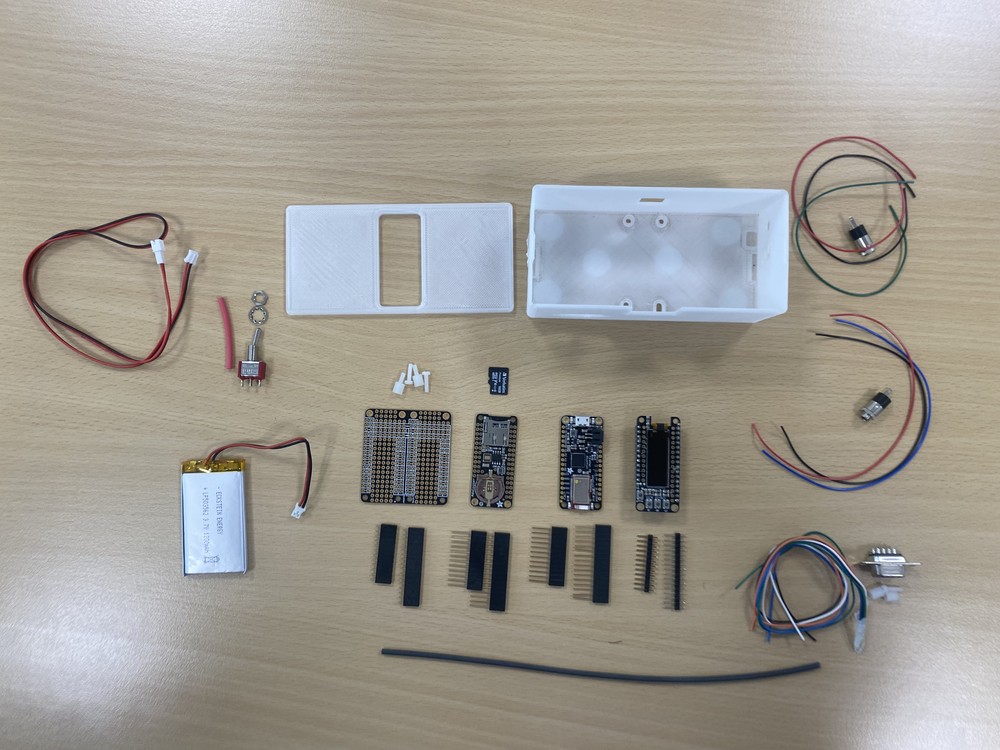

# Liste du matériel

* 1 Feather M0 Bluefruit (Adafruit Feather M0 Bluefruit LE)
 https://www.adafruit.com/product/2995 
 avec broches empilables longues 
https://www.adafruit.com/product/2830 
   
 
 * 1 FeatherWing de prototypage double (proto shield)
 https://www.adafruit.com/product/2890
avec broches empilables courtes 
 https://www.adafruit.com/product/2886  
 

* 1 FeatherWing lecteur de carte SD 
https://www.adafruit.com/product/2922 

* 1 FeatherWing écran OLED 128x32 (assemblée)
 https://www.adafruit.com/product/3045 
  
* 1 carte mini SD (4 Go) 

* 1 batterie LiPo (max 1200 mA pour que cela rentre dans le boîtier)
   3.7v 1000 or 1200mAh 
   https://www.adafruit.com/product/258
   
   (Attention à la connectique de la batterie si ce n'est pas le modèle Adafruit. Certaines batteries LiPo sont connectées à l'inverse de celle de la photo. Vous pouvez inverser les fils en les dégageant du connecteur avec une petite pointe)

* 1 interrupteur de type switch 
 https://www.adafruit.com/product/3221 
  
* 1 câble de connection JST-PH 
 https://www.adafruit.com/product/1131
 
* 2 x 3.5mm connecteur jacks stéréo femelles 
 
* 1 connecteur femelle (Sub-D) DB9 
 
* 4 vis M2.5 x 25 ou 22 + écrous pour visser la feather sur le boîtier 

* 2 vis 3x8 + écrou pour visser le connecteur DB9 

* fils de connection 

* manchons thermo-rétractables

* 1 boîtier à imprimer en 3D (cf les fichiers [stl](../Hardware/BaahBox/))
 

