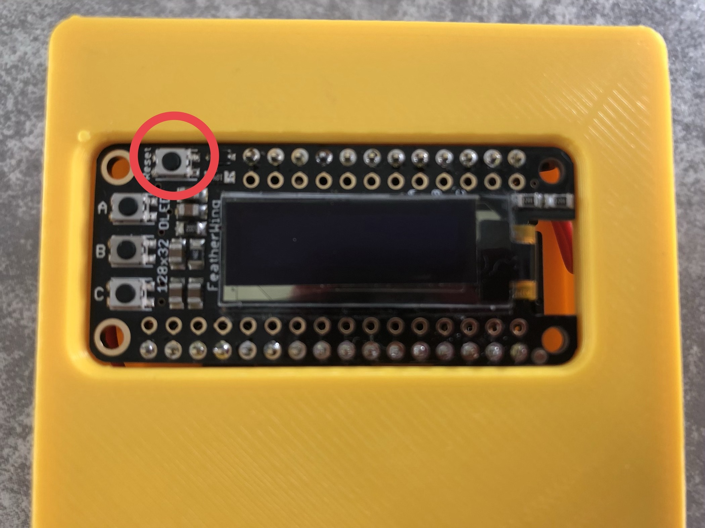
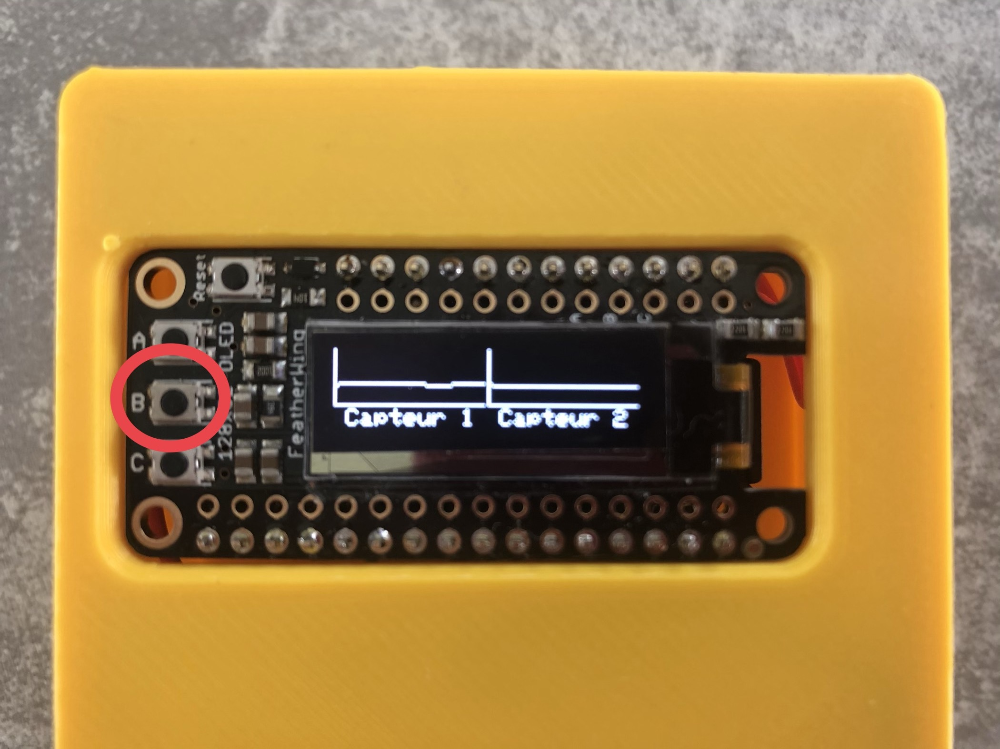
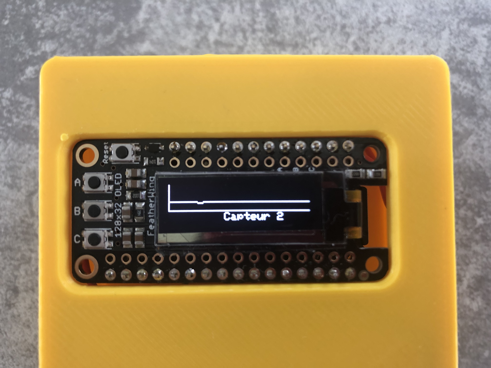
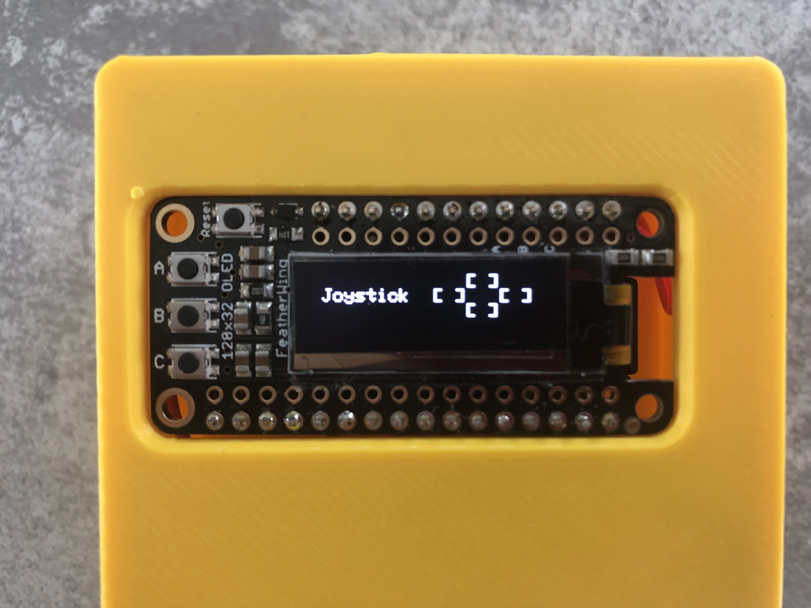

# Mode d'emploi de la Baah Box

#### Version 0.1 du 28/05/2019

&nbsp;

## Initialisation
- Brancher les capteurs sur le boîtier (par les prises jack, comme sur la photo ci-dessus)

- Allumer avec le petit interrupteur sur le coté du boîtier (interrupteur vers le scotch rouge).

##### Attention: La mise en route peut prendre plusieurs secondes.

 

- Attendre 2-3 s si l'écran affiche des petits points blancs.

- Appuyer sur le bouton **Reset** en haut à gauche de l'écran, et au bout de 2s l'écran affiche "Baah Box":

 

## Vérification du bon fonctionnement des capteurs

- Positionner les capteurs sur les muscles à entraîner.

- Appuyer sur le bouton **-B-** pour afficher les courbes des données envoyées par les capteurs.

- Un appui affiche les 2 capteurs,

- Le 2ème appui affiche le capteur 1 seul,

- Le 3ème appui affiche le capteur 2 seul,

- Le 4ème appui affiche les informations sur le joystick,

- Un appui supplémentaire revient à l'affichage des 2 capteurs.

## Informations générales sur le boitier

- Appuyer sur le bouton **-C** pour afficher les paramètres globaux du boitier.

- Un 2ème appui affiche les informations sur le niveau de batterie du boitier

&nbsp;

## Connexion à l'application mobile

- Vérifier que sur le mobile/la tablette le mode bluetooth est activé.

- Lancer le jeu **Baah!** sur le mobile/la tablette

- Un message apparaît demandant de choisir la Baah Box sur laquelle on veut se connecter

- cliquer sur **"Connexion"**

L'écran de connexion apparaît

- choisir la box __-puis-__ cliquer sur OK en haut à droite

### Revenir au menu principal en cliquant sur la flèche en haut à gauche.

## Choisir un jeu en cliquant sur le bandeau correspondant

Pour chaque jeu, une petite animation montre ce qu'il faut faire.  Il faut cliquer sur **"Commencer"** pour jouer.

### Information importante pour les jeux

#### Pensez à fermer l'application sur la tablette/le mobile après chaque utilisation.

&nbsp;

## Les réglages

Pour accéder aux différents réglages, il faut appuyer sur la petite roue crantée située en haut à droite de l'écran du mobile/de la tablette.

##### Plusieurs catégories de réglages sont disponibles:

- Connexion : pour sélectionner une autre BaahBox
- Général :
	- Activation du mode démo
	- Sélection des capteurs à utiliser
	- Réglage de la sensibilité des jeux et du seuil de détection des capteurs
- Gestion des jeux : pour régler les paramètres spécifiques à chaque jeu

### Réglage de Connexion
Cette partie gère la connexion et la déconnexion de votre BaahBox.

Sélectionnez la BaahBox dans la liste proposée. Appuyez ensuite sur OK en haut à droite de l'écran.
Lorsque la connexion est effective, l'application revient sur l'écran précédent.

Lorsque votre mobile est déjà connecté à une BaahBox, celle-ci apparaît avec une coche sur sa gauche. Appuyer sur le bouton "Se déconnecter" pour vous déconnecter de cette BaahBox.

### Réglage Général
Cette partie permet de configurer des paramètres globaux à toute l'application. Une fois terminé, appuyez sur "Paramètres" en haut à gauche pour revenir à l'écran précédent.

 

### Réglages des jeux

Cette partie permet un paramètrage spécifique à chaque jeu.
Une fois les paramètres sélectionnés, ils sont immédiatement pris en compte par le jeu.

&nbsp;

# Annexe

## Utilisation des boutons du boîtier

Il y a 3 boutons à gauche de l'écran (**A**, **B**, **C**)

et un bouton au dessus de l'écran : **Reset**

### Le bouton **Reset** permet de redémarrer le boîtier
### Le bouton **A** affiche la page d'accueil (la bannière Baah Box)

### Le bouton **B** sert à vérifier le bon fonctionnement des capteurs
(voir la section correspondante au début du document)

### Le Bouton **C** affichage des informations de configuration et le niveau de batterie

- 1er appui : affichage des informations suivantes :

	- BTLE : nom de la Baah Box (defini sur la carte SD)
	- Canaux utilisés : association des broches de capteurs aux capteurs 1 ou 2 (défini sur la carte SD)
	- Version : version du logiciel "Baah Box"

- 2eme appui : visualisation des informations sur la batterie
	- tension batterie
 	- % de charge
 	- graphe de visualisation rapide de l'état de charge

# Pour recharger la batterie du boîtier

## Important

###Pour recharger la batterie, il faut brancher le boîtier sur le chargeur USB,
### **mais laisser le boîtier allumé** (interrupteur vers le scotch rouge)
