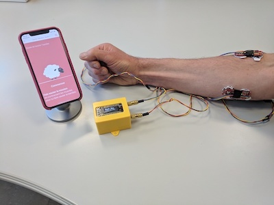
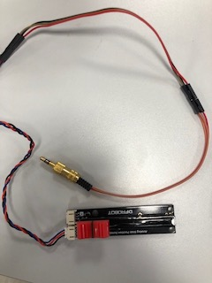
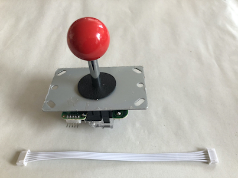
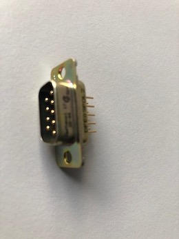
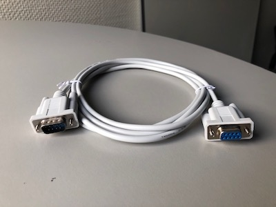
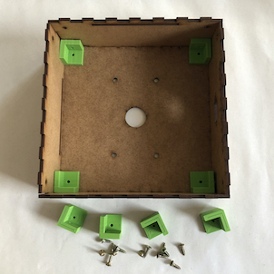
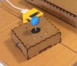

# Exemple de capteurs pour la Baah Box

## A. Capteurs myo-éléctriques

Principe de base : les capteurs de muscles delivrent un signal analogique proportionnel à l'influx musculaire exercé sur eux.

Voici deux marques de capteurs de ce type:  
	- https://www.sparkfun.com/products/13723 
	- https://www.seeedstudio.com/Grove-EMG-Detector-p-1737.html

Le positionnement des capteurs sur le bras du patient est assez délicat; sur chaque capteur il y a deux électrodes qu'il faut positionner dans le sens des fibres musculaires, plus une troisième électrode à mettre dans une zone neutre.

### Plan de connexion

On peut voir sur la droite du plan de connexion  les 3 points de connexions que nous utilisons : "+", "-", "sig".

**_NB:_** Lorsque vous utiliserez le capteur, n'oubliez pas de le calibrer avec le petit potentiomètre que l'on voit à gauche en bas sur le plan ("adjustable gain"). 

## Soudure

Pour utiliser un capteur myo-éléctrique avec la Baah box,

 
Il faudra relier un jack stéréo au capteur via 3 cables (alimentation, masse et signal), d'environ un mètre de long.

### Tester les connexions avec des potentiomètres (*sliders*)

Vous pouvez aussi tester (et jouer!) les applications et la connexion avec la Baah Box avec des potentiomètres (*sliders*) !

(Toujours en reliant le jack au potentiomètre en utilisant les broches VCC, GND, et SIG)

## B. Joystick

Nous utilisons un joystick de borne d'arcade.

Nous utilisons aussi le cable de connexion fourni avec, 
dont nous coupons une des extrémités pour la souder sur une prise DB9 mâle.

La table ci-dessous montre les connexions à effectuer. 

On pourra ainsi connecter le joystick avec le boîtier de la BaahBox avec un cable DB9 mâle-femelle.

On peut ensuite monter le joystick dans une boîte, 
avec la prise db9 vissée sur le coté.

****
