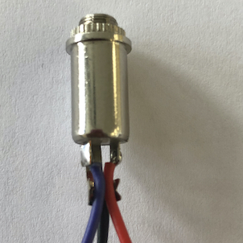
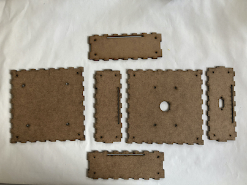
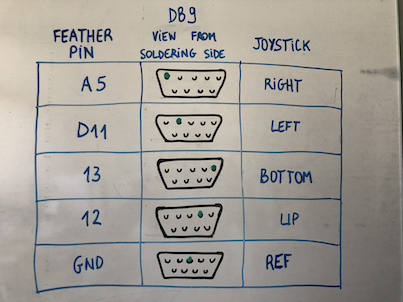

# WIP !!!

# Exemple de capteurs pour la Baah Box

## Capteurs myo-éléctriques

Principe de base : les capteurs de muscles delivrent un signal analogique proportionnel à l'influx musculaire exercé sur ce capteur.

Nos capteurs sont de chez Adafruit de type Myoware Muscle Sensor 
https://www.sparkfun.com/products/13723
une autre marque : 
https://www.seeedstudio.com/Grove-EMG-Detector-p-1737.html

Le positionnement des capteurs sur le bras du patient est assez délicat; sur chaque capteur il y a deux électrodes qu'il faut positionner dans le sens des fibres musculaires, plus une troisième électrode à mettre dans une zone neutre.

Jack

## Sliders

## Joystick

....
