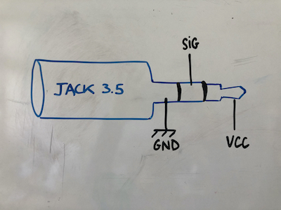

# Fabriquer une Baah Box

# Matériel
La Baah Box comprend : 
* une carte arduino compatible BTLE,
* un support pour souder les cables de connection (proto shield),
* un shield lecteur SD - avec une carte SD de 4Go, 
* un écran TFT, 
* des connecteurs (2 jacks et/ou un connecteur DB9), 

le tout dans un boîtier imprimé en 3D.

**NB:** 
_On peut ajouter en option une batterie et un interrupteur_

Les jacks servent à connecter des capteurs à une seule sortie analogique comme des capteurs myo-électriques ou des potentiomètres (sliders). Les jacks peuvent être utilisés indépendamment seuls ou ensemble.

Le DB9 sert à connecter un capteur à plusieurs sorties (numériques). Vous pourrez y brancher par exemple un joystick de borne d'arcade (voir plus bas pour la construction d'un joystick pour la box).

Le code actuel permet d'utiliser soit les jacks soit le DB9, mais pas les 2 en même temps. Comme ils n'utilisent pas les mêmes entrées sur la carte, le code peut être modifié afin de permettre une utilisation simultanée.

### La liste des éléments de la Baah Box est [ici](BaahBoxBoM_fr.md).

## Choix du matériel

*Nous avons fait le choix de prendre du matériel facile à trouver (dans un magasin d'électronique ou sur internet). Nous voulions que n'importe quel "maker" disposant d'une imprimante 3D et sachant faire des soudures simples puisse fabriquer une Baah Box.*

Le *"form factor"* des cartes que nous avons choisies (Feather de chez Adafruit) permet de les empiler, et donc d'éviter l'utilisation/fabrication d'un circuit imprimé spécifique. Ce qui fait que la construction du boîtier ne nécessite que très peu de soudures.

Il est tout à fait possible d'utiliser d'autres cartes, il faudra juste modifier le boîtier et adapter le code.  

## Impression du boîtier
(téléchargez et imprimez les [fichiers STL](../Hardware/BaahBox/)).
Le design de notre boîtier est une adaptation de celui [proposé par Adafruit](https://learn.adafruit.com/3d-printed-case-for-adafruit-feather)  pour ses cartes Feather.
Adafruit propose des [réglages](https://learn.adafruit.com/3d-printed-case-for-adafruit-feather/3d-printing) pour Cura et Simplify3D, que nous vous conseillons d'utiliser.

## Code de l'arduino

Allez voir par [ici](../../project/README.md)!

## Electronique

### Préparation des cartes 
Nous commençons par souder les broches sur les différentes cartes afin de les empiler.
Attention au sens, il y a un coté ou il y a moins de broches, il faut bien repérer 
ce coté sur la proto shield. 

Une petite astuce pour souder les broches courtes et longues du même coté pour toutes les cartes: Nous avons placé sur toutes les photos, les cartes avec les deux trous de vis cuivrés en haut et le coté court à droite.

Afin d'éviter toute erreur de broches, voici les photos des cartes avec leurs broches avant soudure :

!

 
(NB: la carte Feather wing TFT est souvent envoyée par les revendeurs avec les broches déjà soudées)

Une petite astuce pour souder les broches bien parallèles : retourner la carte avec les broches en place, et y mettre de la patafix pour éviter que les broches ne bougent pendant la soudure...

Photos des cartes avec broches soudées 

Photos des cartes avec broches empilées

 
 
De bas en haut: 
la proto shield, puis la Feather M0, la SD shield, et la TFT. 
   
Il ne reste plus qu'à souder les fils sur la proto shield pour connecter les capteurs.

### Connectique

Nous branchons deux types de connecteurs sur la proto shield:
des jacks stéréo et un connecteur DB9.

#### Jacks
Les jacks servent à connecter des capteurs analogiques à une sortie.
Il faut souder donc 3 fils: Vcc, GND et signal.

Cablage d'un jack mâle: 

cablage d'un jack femelle

  

 On soude les cables "signal"  (bleu et vert) des jack sur les broches analogiques A0 et A1 de la proto shield.

On soude les fils rouge (Vcc) des jacks et de la proto shield ensemble.

  
    
     Premier jack
   
    

Les deux jacks sont soudés !

#### DB9
Le DB9 sert à connecter un capteur à plusieurs sorties (numériques). Nous branchons par exemple  un joystick  de borne d'arcade sur ce connecteur DB9, qui n'a pas besoin d'être alimenté.

Par contre il nous faut brancher 5 cables :
* Un fil (noir) qui servira de référence (soudé à la masse (GND),
* 4 fils pour les contacteurs des différentes positions du joystick.

 

Le connecteur DB9 sera vissé par l'exterieur de la boîte, pour des raisons de solidité.
cela impose de souder ce connecteur en place.
   

  

On soude les fils du connecteur sur la proto shield, selon le tableau ci-dessous:

On voit sur ce schema la correspondance avec les positions du joystick qui sera branché dessus.
Par exemple : lorsque le Joystick sera en position haute, le signal de la la broche 12 de la Feather passera de 0 à 1.

## Montage

On visse les jacks sur la paroi ainsi que  le DB9 ...
Et voici une photo d'une box finie ! 

Il ne reste plus qu'à empiler les cartes, fermer le couvercle  et tester ! 

Il ne reste plus qu'à fermer la boîte !

 

et la brancher sur un joystick....

### Alimentation (option)
Pour que le boîtier puisse être utilisé n'importe où, nous avons ajouté une batterie, et un interrupteur.
Ce n'est pas obligatoire pour faire fonctionner la carte, qui peut juste être branchée sur une alimentation usb (5V).

Nous utilisons une adaptation du montage proposé par Adafruit pour [l'alimentation] (https://learn.adafruit.com/on-slash-off-switches)
Vous y trouverez toutes les informations pour le montage pour réaliser le câble ci dessous.

Dans notre cas, l'interrupteur se visse dans un trou sur la paroi de la boîte, mais le montage reste le même. 

