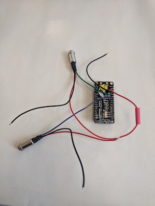
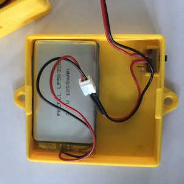
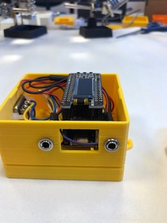
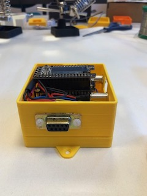
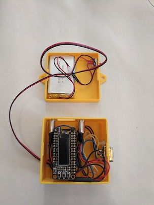
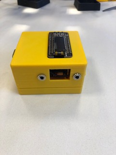

# Fabriquer une Baah Box

# Matériel
La Baah Box consiste en une carte arduino compatible BTLE, un shield lecteur SD - avec une carte SD de 4Go, un écran TFT, et des connecteurs (2 jacks et/ou un connecteur DB9), le tout dans un boîtier imprimé en 3D.

Les jacks servent à connecter des capteurs à une seule sortie analogique comme des capteurs myo-électriques ou des potentiomètres (sliders). Les jacks peuvent être utilisés indépendamment seuls ou ensembles.

Le DB9 sert à connecter un capteur à plusieurs sorties (numériques). Vous pourrez y brancher par exemple un joystick.

Le code actuel permet d'utiliser soit les jacks soit le DB9, mais pas les 2 en même temps. Comme ils n'utilisent pas les mêmes entrées sur la carte, le code peut être modifié afin de permettre une utilisation simultanée.

### La liste des éléments de la Baah Box est [ici](../BaahBoxBoM.md).

## Choix du matériel

*Nous avons fait le choix de prendre du matériel facile à trouver (dans un magasin d'électronique ou sur internet). Nous voulions que n'importe quel "maker" disposant d'une imprimante 3D et sachant faire des soudures simples puisse fabriquer une Baah Box.*

Le *"form factor"* des cartes que nous avons choisies (Feather de chez Adafruit) permet de les empiler, et donc d'éviter l'utilisation/fabrication d'un circuit imprimé spécifique. Ce qui fait que la construction du boîtier ne nécessite que très peu de soudures.

Il est tout à fait possible d'utiliser d'autres cartes, il faudra juste modifier le boîtier et adapter le code.  

## Impression du boîtier
(téléchargez et imprimez les [fichiers STL](../3D/STLBaahBoxDB9.zip)).
Le design de notre boîtier est une adaptation de celui [proposé par Adafruit](https://learn.adafruit.com/3d-printed-case-for-adafruit-feather)  pour ses cartes Feather.
Adafruit propose des [réglages](https://learn.adafruit.com/3d-printed-case-for-adafruit-feather/3d-printing) pour Cura et Simplify3D, que nous vous conseillons d'utiliser.

## Code arduino

Allez voir par [ici](../../project/README.md)!

## Electronique

### Alimentation
Pour que le boîtier puisse être utilisé n'importe où, nous avons ajouté une batterie, et un interrupteur.
Ce n'est pas obligatoire pour faire fonctionner la carte, qui peut juste être branchée sur une alimentation usb (5V).

Nous utilisons le montage proposé par Adafruit pour [l'alimentation] (https://learn.adafruit.com/on-slash-off-switches)
Vous y trouverez toutes les informations pour le montage pour réaliser le câble ci dessous.

### Connectique
Nous branchons deux types de connecteurs sur la carte :
des jacks stéréo et un connecteur DB9.

Pour alimenter les connecteurs, on peut commencer par souder
* le fil rouge sur la broche 3.3V
* le fil noir sur la Feather.

#### Jacks
Les jacks servent à connecter des capteurs analogiques à une sortie.
Il faut souder donc 3 fils: Vcc, GND et signal.

On soude les cables "signal"  (bleu et vert) des jack sur les broches analogiques A0 et A1 de la Feather.

On soude les fils rouge (Vcc) des jacks et de la feather ensemble.
On voit sur la photo qu'on utilise une gaine thermo-rétractable après soudure pour éviter des court-circuits.

#### DB9
Le DB9 sert à connecter un capteur à plusieurs sorties (numériques). Nous branchons un joystick sur ce connecteur DB9, qui n'a pas besoin d'être alimenté.
Par contre il nous faut brancher 5 cables :
* Un fil (noir) qui servira de référence (soudé à la masse (GND),
* 4 fils pour les contacteurs des différentes position du Joystick.

On soude ensemble les cables noirs (GND) des jacks et du dB9 avec le celui de la Feather  

Puis on soude les fils du connecteur sur la Feather, selon le tableau ci-dessous:

On voit sur ce schema la correspondance avec les positions du joystick qui sera branché dessus.
Par exemple : lorsque le Joystick sera en position haute, le signal de la la broche 12 de la Feather passera de 0 à 1.

## Montage

Une fois que tout est soudé, il faut tout rentrer dans le boîtier !

Nous utilisons le mode d'emploi fourni par Adafruit pour monter le boîtier de feather avec une batterie, en y ajoutant nos modifications (ajout des connecteurs).
Nous vous conseillons de suivre les étapes comme indiqué dans ce [mode d'emploi](https://learn.adafruit.com/3d-printed-case-for-adafruit-feather/assembly), en y ajoutant la vissage des connecteurs sur le boîtier.

- On commence par positionner la batterie et l'interrupteur

- on passe le connecteur de batterie par le trou du fond du boîtier
- On met la feather en place dans le boitier.
Comme les cartes s'empilent, vous avez le choix de ne visser que la feather dans le boîtier puis empiler les shields de la carte SD et l'écran.

Avec les vis de entre 19 et 25mm  de long, on peut visser la feather et la carte SD.
Le shield écran est juste clipsé dessus.

- On visse les jacks dans les deux trous circulaires coté façade

 et le DB9 dans son encart sur le coté de la boîtier.

 

Tout est dans la boîte, il faut refermer...

Et voilà la boîte montée !

