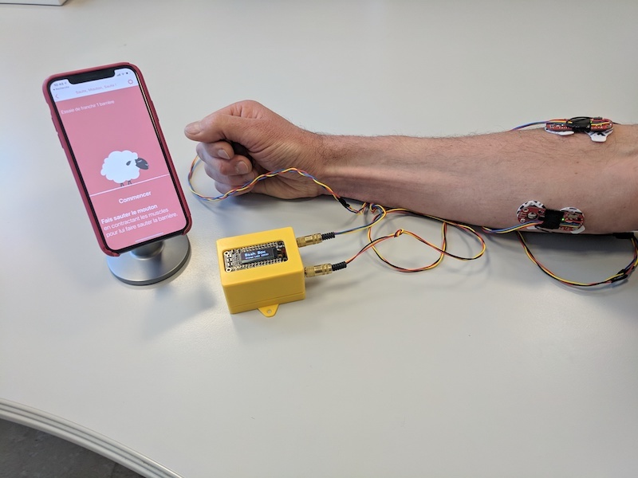
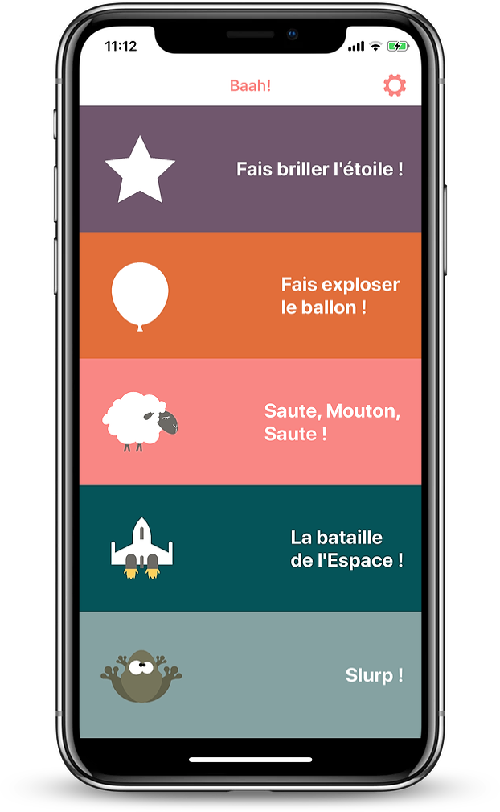
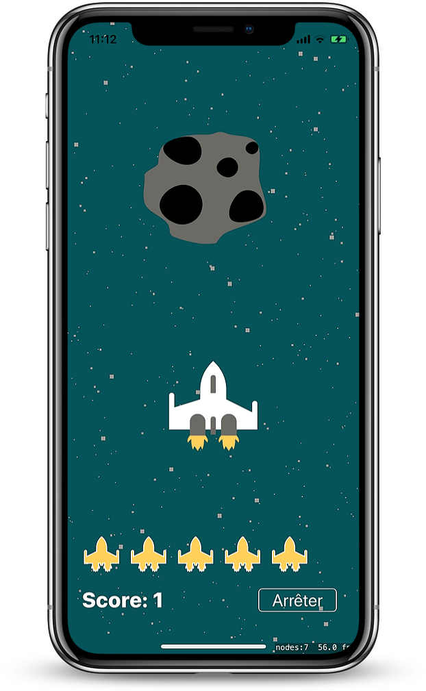
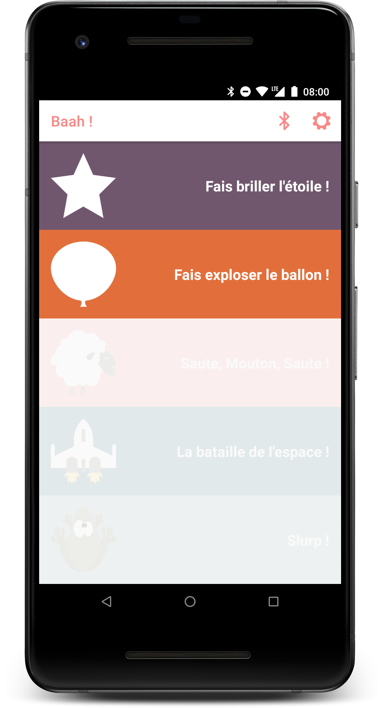
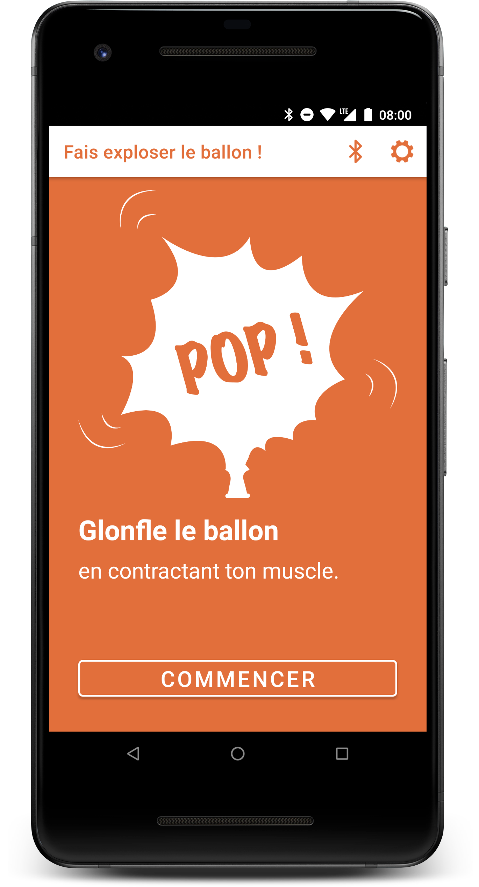

# Qu'est-ce que la Baah Box ?
La Baah Box est un équipement d’aide à la rééducation de muscles suite à un accident ou à un traumatisme, et qui comprend :

* Un boîtier (en jaune sur la photo ci-dessous)
* Divers capteurs musculaires (par ex. un joystick ou des détecteurs de contractions de muscles) 

Le boîtier est connecté via Bluetooth au téléphone mobile.
Des jeux sur le téléphone mobile permettent aux patients de faire bouger des personnages grâce aux contractions musculaires détectées par les capteurs.


# A quoi sert la Baah Box ?

* Pour les accidentés:  **ré-apprendre** à utiliser des muscles en séance d’ergothérapie ou de kinésithérapie - mais aussi à la maison.
* Pour les personnes qui vont être équipées d'une prothèse myo-électrique:  **s’entraîner** au maniement de la prothèse.

# Pourquoi Baah ?

Parce que le mouton est un personnage récurrent de nos jeux … 
et que Baah, *c’est le cri du mouton !* (en anglais)

			
## Quelques images de l'application iOS

<table>
	<tr>
		<td>
			
		</td>
		<td>
			
		</td>
	</tr>
</table>

## Quelques images de l'application Android

<table>
	<tr>
		<td>
			
		</td>
		<td>
			
		</td>
	</tr>
</table>

## Liens

* Les sources Arduino sont dans le répertoire *project* du repo https://github.com/Orange-OpenSource/BaahBox-Arduino
* L'application iOS: https://github.com/Orange-OpenSource/BaahBox-iOS
* L'application Android: https://github.com/Orange-OpenSource/BaahBox-Android
* Les ressources graphiques: https://github.com/Orange-OpenSource/BaahBox-assets

# Vous avez une BaahBox et vous voulez jouer avec ?
Jetez un coup d'oeil sur le [Manuel d'utilisation](BaahBoxManual_fr.md)

Nous allons publier les applications sur les stores d'ici peu.

# Vous voulez une BaahBox ?

Deux solutions: rapprochez vous d'un FabLab ou d'un maker pour la faire faire...
ou bien fabriquez-la vous même !

## Fabriquez votre Baah Box

 Il vous faudra un peu de matériel éléctronique (notamment une carte arduino compatible Bluetooth 4.0 (BTLE), quelques connecteurs) et l'accès à une imprimante 3D pour fabriquer le boîtier. 
 [Suivez le guide !](BuildingBaahBox_fr.md)

## Téléchargez le code à mettre sur la Baah Box
Vous trouverez le code arduino pour la carte de la Baah Box dans le repo [Arduino](https://github.com/Orange-OpenSource/BaahBox-Arduino)
 
## Fabriquez vos capteurs

Vous avez deux possibilités pour connecter des capteurs à la baah Box: 

* **Par les prises jack:**
 Tout capteur à une sortie analogique, compatible arduino et alimentable en 3.3V.
 Par exemple les capteurs myo-électriques présentés plus bas, ou des potentiomètres.
 
* **Via le connecteur DB9:**

 Ce connecteur permet de brancher sur la Baah Box des capteurs à sorties multiples comme un joystick de console de jeux (exemple présenté plus bas).
 Les sorties de celui que nous avons utilisé sont binaires, mais on peut avoir des sorties analogiques. Il faudra par contre modifier le code de la carte arduino pour prendre en compte un nouveau capteur.

### Exemples de capteurs 

Fabriquez un [joystick interactif ou des capteurs myo-électriques](./BaahBoxSensors_fr.md) pour votre Baah Box.

